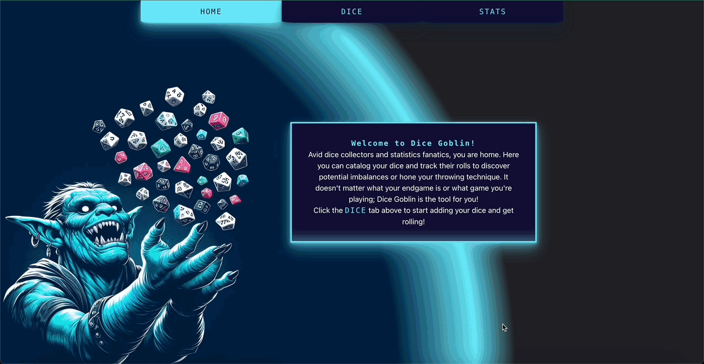

# Dice Goblin

Do you like to roll dice? Are you fascinated by statistics, or obsessed with how balanced your dice are? If your response to any of the preceding questions was "yes" or even "eh, kind of... I guess", read on. Whether it be for games of chance, board games, or TTRPGs, Dice Goblin is here to track all of your dice rolls and help you answer questions like "Which of my d20s rolls the highest numbers on average?" or "Does this particular dice throwing technique really result in fewer sevens?". Find out if your dice are balanced or if they fly in the face of probability itself as you log countless rolls and watch the averages change in real time.
<br>[<b>Here's a video demonstration of how the app works!</b>](https://youtu.be/pMznK35uu4A)

## Requirements
You will need to have [Node Package Manager](https://docs.npmjs.com/downloading-and-installing-node-js-and-npm) and [Ruby](https://www.ruby-lang.org/en/documentation/installation/) installed to use Dice Goblin.<br>

## Installation
- In this application's GitHub repo, click the fork button to create a copy for yourself. Next, in your own fork, click the 'Code' button, make sure SSH is selected, and copy what's there.<br>
- Head into your CLI (Command Line Interface) and navigate to the directory where Dice Goblin will live. Type in "git clone ", paste in the SSH you copied, and run the command.<br>
- Once it's done, navigate into the new directory and you're ready to begin using Dice Goblin!

## Usage
To get started, make sure you are in the correct directory, and type this in your terminal:
```shell
~/dice-goblin$ cd frontend
~/dice-goblin/frontend$ npm install && npm start
```
A browser window will open with Dice Goblin running, but we're not done yet; open a new terminal and input:
```shell
~/dice-goblin$ cd backend
~/dice-goblin/backend$ bundle install
~/dice-goblin/backend$ rake db:migrate
~/dice-goblin/backend$ rake server
```
<i>* You can optionally add db:seed right after db:migrate to see how the app works with some default dice data</i><br><br>
This will get the Dice Goblin server running on http://localhost:9292/. Then you're all set!
You are now ready to start adding dice to your collection and tracking their rolls.<br><br>



## Contributing
Pull requests are welcome. For major changes, please open an issue first to discuss what you would like to change.

## Roadmap
Future plans include switching to a Java backend, allowing users to upload image files directly, improving the stats page, and a refreshed UI that replaces Bootstrap with components from my own library.

## Acknowledgements
- Image on the 'Home' page generated using [Bing Image Creator](https://www.bing.com/images/create/), powered by DALL-E 3.
- Dice Goblin was built with the help of components from [React Bootstrap](https://react-bootstrap.github.io/).
- Application created using [Create React App](https://create-react-app.dev/).
- Images in seed data hosted with [Cloudinary](https://cloudinary.com/).


## License
[MIT](https://choosealicense.com/licenses/mit/)